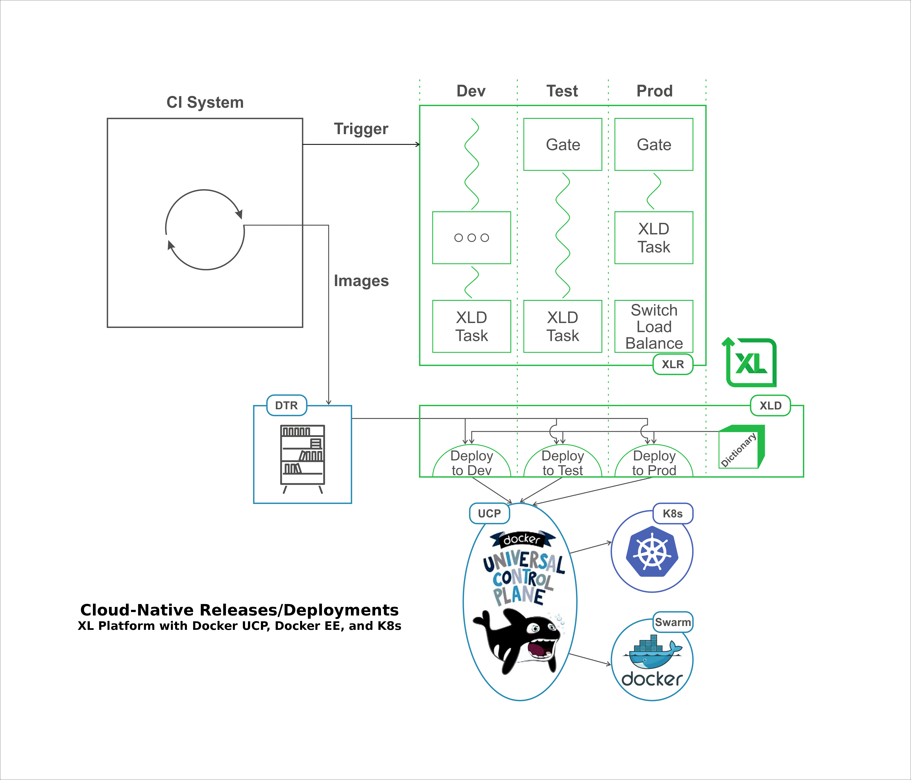

# Docker Universal Control Plane integration for XL Deploy (_BETA_)

[![License MIT][license-image]][license-url]
[](https://github.com/RichardLitt/standard-readme)

> The UCP XL Deploy plugin enables the creation of objects through UCP.

## Important Notes

1. This is a first-steps beta version
1. The plugin automatically handles session tokens, so provide just a username and password in the UCP instance configuration
   1. The user must have permission to generate session tokens, and also carry out any operations that XL Deploy will execute (such as service creation and deletion)
1. To enable easy connection with sandbox/test UCP instances, SSL certificate verifications are skipped.  To resume strict checking of SSL certificates change http_request.py from:
```python
sslContext = SSLContextBuilder.create().loadTrustMaterial(TrustSelfSignedStrategy()).build()
allowAllHosts = NoopHostnameVerifier()
connectionFactory = SSLConnectionSocketFactory(sslContext, allowAllHosts)

client = HttpClients.custom().setSSLSocketFactory(connectionFactory).build()
```
to
```python
client = HttpClients.createDefault()
```

## Concept

The example use case below combines the XL Platform with Docker EE systems.



Since Kubernetes and Swarm use a declarative model for application deployments, upgrade deployments are handled simply by removing the object spec and replacing it with the new one.

### Native control of Docker Swarm and Kubernetes through XL Deploy

_The XL Deploy [Kubernetes plugin](https://docs.xebialabs.com/xl-deploy/concept/xl-deploy-kubernetes-plugin.html) and [Docker plugin](https://docs.xebialabs.com/xl-deploy/concept/docker-plugin.html) enable direct control of Swarm and Kubernetes objects._

## Installation
### Building the Plugin
The gradle wrapper facilitates building the plugin.  Use the following command to build using [Gradle](https://gradle.org/):
```bash
./gradlew clean build
```
The built plugin, along with other files from the build, can then be found in the _build_ folder.

### Adding the Plugin to XL Deploy

For the latest instructions on installing XL Deploy plugins, consult the [associated documentation on docs.xebialabs.com](https://docs.xebialabs.com/xl-deploy/how-to/install-or-remove-xl-deploy-plugins.html).

## Setup

### Infrastructure
Create a new infrastructure container in the Library.  The path is _ucp > instance_.  The "common" section is probably the only place where properties need to be changed.  UCP requires HTTPS communication.  Provide the https:// protocol in the URL.  Keys/tokens should not be used in the configuration - only a username and password which will then be used to fetch session tokens.

### Application Deployment Packages
Deployment packages can contain Swarm Service Specs (_ucp>swarm>ServiceSpec_) and Swarm Network Specs (_ucp>swarm>NetworkSpec_).  Service Port Specs (_ucp>swarm>ServicePortSpec_) are handled as an embedded deployable under ServiceSpec.

## Usage

The configuration items for this plugin:
1. Docker Swarm Services (type ucp.swarm.Service)
1. Docker Swarm Service Ports (type ucp.swarm.ServicePort)
1. Docker Swarm Networks (type ucp.swarm.Network)

## Contributing

Please review the contributing guidelines for _xebialabs-community_ at [http://xebialabs-community.github.io/](http://xebialabs-community.github.io/)

## License

This community plugin is licensed under the [MIT license][license-url].

See license in [LICENSE.md](LICENSE.md)

[license-image]: https://img.shields.io/badge/license-MIT-yellow.svg
[license-url]: https://opensource.org/licenses/MIT 